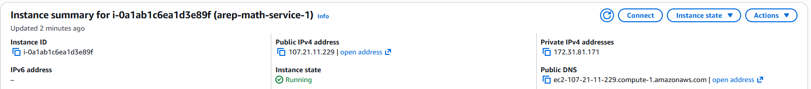
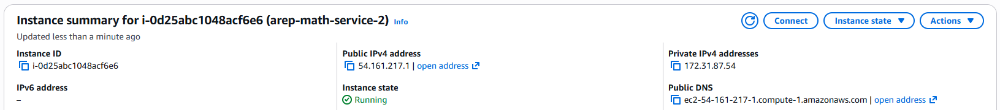
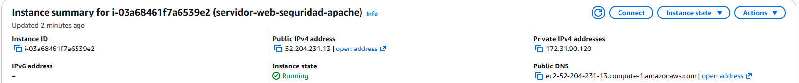
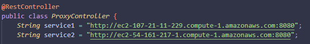
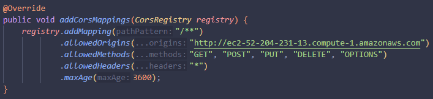
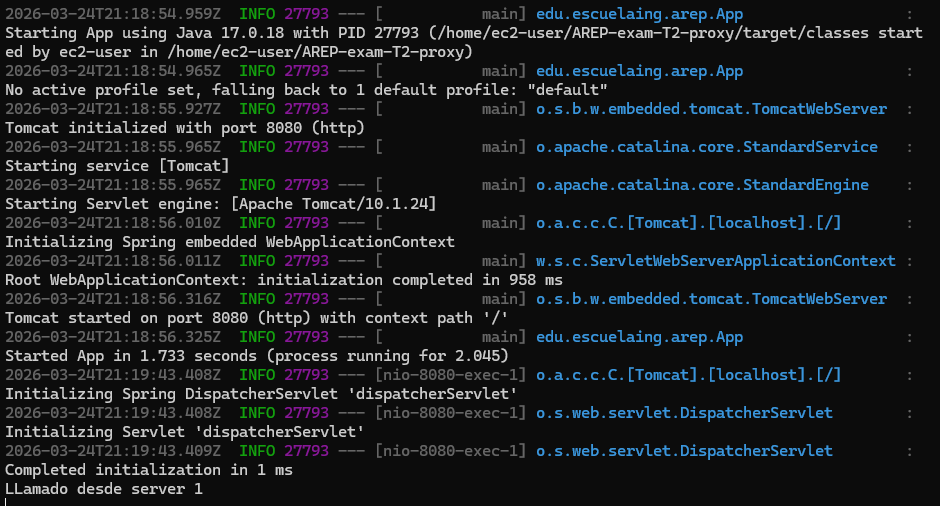
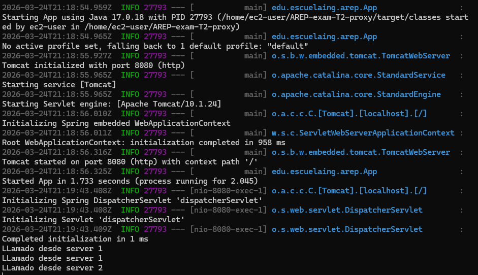
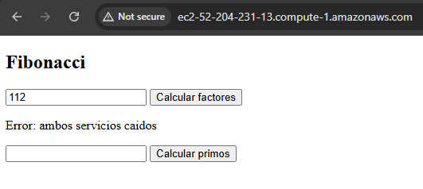
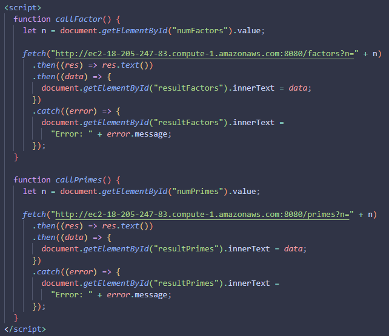
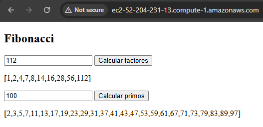

# AREP-exam-T2-proxy

## MathService 1

## MathService 2

## Proxy

El proxy apunta a cada una de las 2 instancias donde estan los servicios

Se configuran los CORS para que el proxy acepte las peticiones del front

Si ambos servidores estan corriendo, el servidor 1 responde

Si el servidor 1 se apaga, el proxy intenta llamarlo pero no respondera, por lo que luego llamara al servidor 2 respondiendo

Por ultimo, si ambos se apagan muestra un mensaje

## Apache

El front apunta a la instancia donde se encuentra el proxy

Donde podemos evidenciar que el proxy responde

